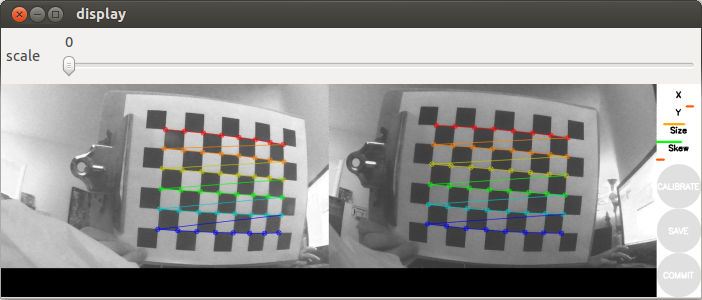
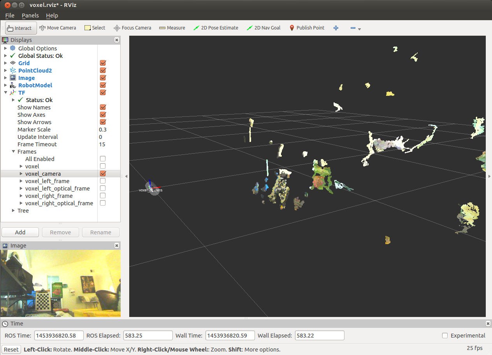

# voxel-ros-pkg

A ROS package for the Blue Robotics [Voxel Stereo Camera](https://www.bluerobotics.com/store/electronics/voxel-stereo-camera/).

## Setup

These setup instructions assume that you have `ros-jade-desktop-full` installed (ROS Indigo should be fine too) and a catkin workspace at `~/catkin_ws`. If you don't, follow the [Installing and Configuring Your ROS Environment](http://wiki.ros.org/ROS/Tutorials/InstallingandConfiguringROSEnvironment) tutorial before proceding.

The voxel camera modules rely on the [gscam](http://wiki.ros.org/gscam) ROS package which unfortunately has not been released to `apt` in ages ([github issue](https://github.com/ros-drivers/gscam/issues/17)). As such, you'll need to install `gscam` in your local catkin workspace first:

```bash
git clone https://github.com/ros-drivers/gscam ~/catkin_ws/src/gscam
rosdep -y install gscam
# enter password

cd ~/catkin_ws
catkin_make
```

Then you can install the voxel package:

```bash
git clone https://github.com/bluerobotics/voxel-ros-pkg.git ~/catkin_ws/src/voxel

# setup udev rules
sudo cp ~/catkin_ws/src/voxel/extra/99-voxel-camera.rules /etc/udev/rules.d/
sudo udevadm control --reload-rules && sudo service udev restart && sudo udevadm trigger
```

## Calibration

The calibration process removes distortion from the individual cameras. This process is essential for producing a quality disparity image.

To calibrate the cameras, first print out the [8x6 checkerboard](extra/checkerboard-8x6.pdf) on an 8.5x11 inch piece of paper. Attach the checkerboard printout to something firm like a clipboard. (Add a bit of tape to the bottom two corners to keep the page flat.) Then run the following:

```bash
roslaunch voxel calibrate.launch
```

The calibration process measures a range of four key attributes: X, Y, size, and skew. Hold the checkerboard up in front of the cameras and vary each of the parameters. (So move the checkboard left and right, up and down, father and closer, and at different angles.) Make sure that the entire calibration grid stays within view of both cameras. You'll know the calibration process is working when you can see a colored grid in each camera view and when the size of attribute bars are increasing.



When the calibration process has gathered enough information about a particular attribute, the cooresponding bar will turn green. With practice, the calibration process should take about one minute to complete. Hit the "calibrate" button once all four bars are green. After a few moments, new rectified images should be displayed. Hit the "commit" button to complete the process.

For more information, check out the [ROS Stereo Calibration Tutorial](http://wiki.ros.org/camera_calibration/Tutorials/StereoCalibration) as well as the [OpenCV Camera Calibration](http://docs.opencv.org/2.4/modules/calib3d/doc/camera_calibration_and_3d_reconstruction.html) documentation.

## Usage

To start the cameras:

```bash
roslaunch voxel voxel.launch
```

You now have available topics such as `stereo/left/image_rect_color`, `stereo/left/image_rect_color`, and `/stereo/points`. You'll likely also want to include the voxel macro in your urdf file. Look at the [voxel_standalone.urdf.xacro](description/voxel_standalone.urdf.xacro) file for an example of how to do that.

To quickly view a camera image and the resulting point cloud, try out the included rviz configuration:

```bash
roslaunch voxel rviz.launch
```



## Notes

For those curious, I have tried a few other camera drivers and may switch recommended drivers in the future. Here is a list of the other drivers that I have tried and the roadblocks I encountered with each one:

* [usb_cam](http://wiki.ros.org/usb_cam): getting "overread" errors; image looks bonkers because of it
* [libuvc_camera](http://wiki.ros.org/libuvc_camera): works for one camera, but the process for the second camera always hangs on init ([github issue](https://github.com/ktossell/libuvc_ros/issues/28))
* [uvc_camera](https://www.google.com/url?sa=t&rct=j&q=&esrc=s&source=web&cd=2&cad=rja&uact=8&ved=0ahUKEwiOl5uem8vKAhVH1mMKHfs_BjIQFggjMAE&url=http%3A%2F%2Fwiki.ros.org%2Fuvc_camera&usg=AFQjCNEV09wbqsSJRTqIQomJM_EVosr-8g&sig2=mOZgwnFkUEa3V5Yt7_Po6w): image is only black and white and framerate is never more than 5 Hz (this driver is also deprecated)

## Change History

This project uses [semantic versioning](http://semver.org/).

## v0.1.0 - 2016/01/27

* Initial release.
* Stereo camera working with `gscam` and two [ELP-USBFHD01M](http://www.amazon.com/ELP-Driver-Camera-Module-ELP-USBFHD01M-L21/dp/B00KA7WSSU/ref=pd_sim_147_2?ie=UTF8&dpID=41HNP%2BZXJuL&dpSrc=sims&preST=_AC_UL160_SR160%2C160_&refRID=0K7CKWSDSNFEWPV613WY) cameras
